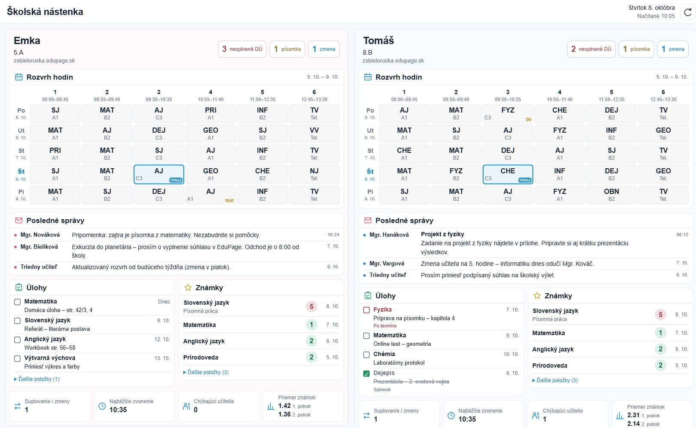
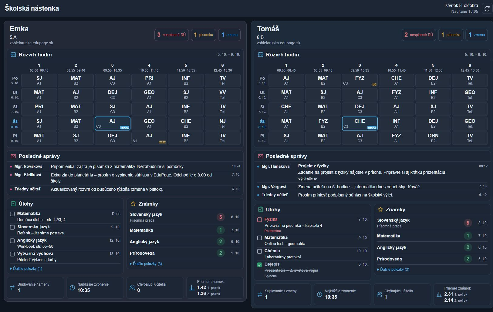
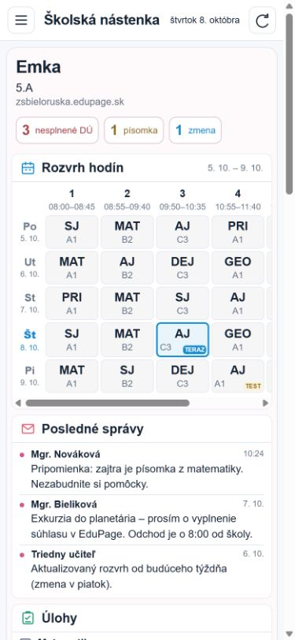

# Vizuálne overenie EduPage 2026.10.1

Referenciou je mock v [PR #7](https://github.com/denkz0ne/haos_edupage/pull/7), spresnený v [návrhu](EDUPAGE_SCHOOL_BOARD_DESIGN.md), a používateľova požiadavka odstrániť vnútorný modrý bočný pás a uvítanie. Náhľady používajú vymyslených žiakov Emku a Tomáša; neobsahujú export školských údajov.

## Vzhľad

- 1640 × 960: dve deti vedľa seba, bez vnútornej navigácie a uvítacieho bloku; prehľad je na jednej stránke.
- Rozvrh: neutrálna mriežka Po–Pi, čas pod číslom hodiny, rovnomerné bunky, malé stavové markery. Aktuálna hodina je jediná výrazne zvýraznená bunka.
- Typografia: meno 24 px, sekcie 17 px, rozvrh 16 px, správy 14 px. Plné názvy predmetov a detaily hodín sú dostupné v titulku bunky.
- Správy: celé znenie, vrátane situácie so samostatným nadpisom aj telom. Úlohy a Známky sú vedľa seba; ďalšie položky sa rozbaľujú inline.
- 390 × 844: žiaci sú pod sebou a Úlohy so Známkami sa skladajú. Vodorovný posun je obmedzený na rozvrh; stránka nepresahuje šírku obrazovky.
- Svetlý aj tmavý motív používajú farby Home Assistanta. Pri dlhých správach alebo rozbalení ďalších položiek stránka prirodzene rastie a dá sa posúvať.

## Načítanie a interakcia

- Scenár s 9-sekundovým oneskorením rozvrhu a todo prvého žiaka: obidve hlavičky, šesť správ a známky sú zobrazené skôr; rozvrh druhého žiaka už funguje, prvý má vlastný indikátor načítania.
- Rozbalené známky zostali otvorené po dokončení oneskorených požiadaviek. Obnovenie obsahu zachováva aj vodorovný posun rozvrhu a fokus rozbalovacieho riadku.
- Cache je izolovaná podľa autentifikovaného HA spojenia. Zmena spojenia vymaže údaje komponentu; oneskorené odpovede starého spojenia sa ignorujú.
- Chyby jednotlivých zdrojov vrátane kalendára označení DÚ/písomiek sú viditeľné. Na chybe jedného zdroja nezávisia ostatné sekcie.
- Automatizované frontendové testy kontrolujú postupné načítanie, znovupoužitie cache, explicitné obnovenie, izoláciu spojení a neskorých odpovedí, rozdielne časy zvonenia, dvojhodinovky, kalendárne dateTime objekty, DST interval, celé správy, chybové a stale stavy a ignorovanie nesúvisiacich HA aktualizácií.

## Reprodukcia

Z koreňa repozitára spustite `python -m http.server 8188 --bind 127.0.0.1` a otvorte `http://127.0.0.1:8188/tests/frontend/school-board-preview.html`.

Parametre náhľadu: `?theme=dark`, `?scenario=slow`, `?scenario=empty`, `?scenario=error`. Čas v náhľade je zmrazený iba vo fixture, aby bola aktuálna hodina reprodukovateľná.

Frontendové testy: `node --test tests/frontend/school-board.test.mjs`. Bežia aj v GitHub Actions.

Tieto náhľady overujú skutočný frontendový komponent so vzorovými odpoveďami Home Assistanta. Produkčný panel po používateľovej HACS aktualizácii zostáva samostatným overením.
